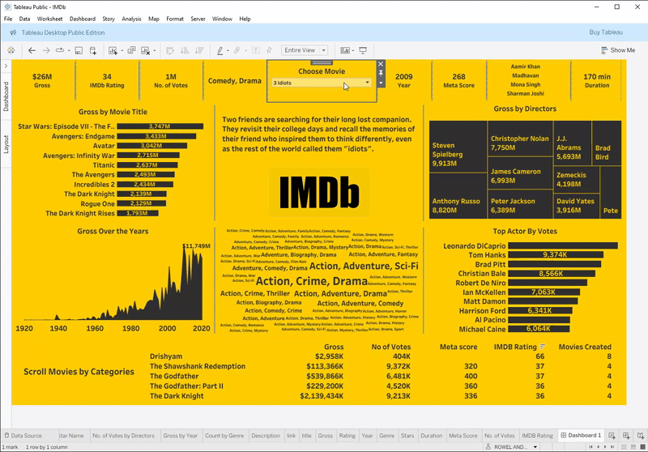

# IMDB-movies
IMDB Dataset of top 1000 movies and tv shows.

Special thanks to @DataScienceRoadMap tutorial in youtube for this dashboard idea.
**Project:** Data to Dashboard in 22 minutes (https://www.youtube.com/watch?v=14eWTss1tXQ&list=PL7RSbI9s6KhgovdILZ-lIpW-LTkduE-ll)

# IMDB-movies
Built in Tableau — the dashboard highlights what matters fast so viewers can compare top movies at-a-glance and drill into one title for details.

## Project Goal
Main objective of this project is to improve dashboard design and to get comfortable to other functions.
Enable users to interactively explore top movies by different categories.

## Overview
We wanted to know which movies are on top 10, top Actors, top Director etc...

## Key Features
- 🎯 **Single selector (Choose Movie):** one dropdown that filters every KPI on top page
- 🧾 **KPI cards:** Gross, IMDb rating, No. of votes, Year, Meta score, Duration etc..
- 📊 **Top-10 visualizations:** Gross by Movie Title (bar), Top Actor by Votes (bar), Gross by Directors (treemap)
- 📈 **Gross over time:** area chart showing box-office trends by year (with peak callouts)
- 🧭 **Genre insights:** genre word-cloud/tag cluster to show dominant genres for the selected title and overall dataset
- 🧩 **Scrollable detail table:** scrollable list of movies with Gross, No. of Votes, Meta score, IMDb rating for easy comparison
- 📝 **Summary panel (center):** movie synopsis and brand/logo area that updates with the selected movie — a quick contextual snapshot

## Files in this repository
- `dataset/` — 
- `README.md` — this file  
- `image/` — 

## How to open Tableau Dashboard
1. click: https://tinyurl.com/imdb-mov

## Contact
Rowel Andrew Legaspi (Drew)  
- LinkedIn: https://www.linkedin.com/in/rowel-andrew-legaspi-289936241/
- Tableau Profile: https://public.tableau.com/app/profile/rowel.andrew.legaspi

